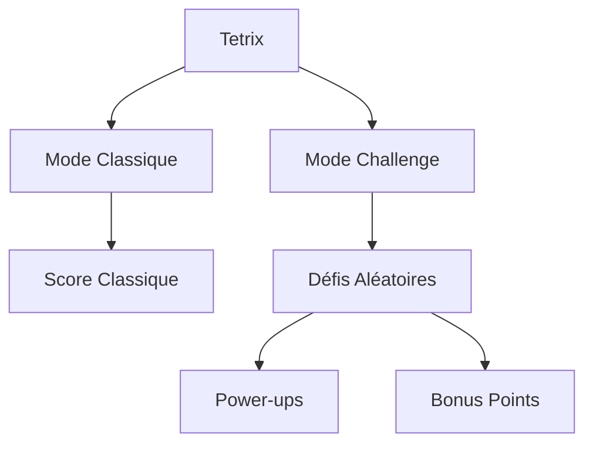

# 🎮 Tetrix - Jeu de Tetris Moderne

<div align="center">

[](https://git.io/typing-svg)

<p align="center">
  
  
  
  
</p>


</div>

## 🎯 Vue d'ensemble du Jeu

Tetrix est une version moderne du classique jeu Tetris, offrant une expérience de jeu améliorée avec des modes de jeu variés, des power-ups et un système de scores.

```
                                    ██████████  The Legendary Long Piece
                                    ██████████  "Hero Tetromino"
                                    ██████████  Since 1984
                                    ██████████
                                       ||||
                                       ||||     "When you need it most,
                                       ||||      it appears least..."
                                       ||||
                                    
        ████████                ██████████████            ████████
        ████████                ██████████████            ████████
        ████████                ██████████████            ████████
        ████████                ██████████████            ████████
```

> 🎮 **L'Art ASCII ci-dessus représente :**
> - La pièce "I" (Hero Tetromino) au centre, la plus emblématique du jeu Tetris
> - Créée en 1984 par Alexey Pajitnov, cette pièce est devenue légendaire
> - La citation fait référence à une blague commune dans la communauté Tetris :
>   cette pièce a tendance à ne pas apparaître quand on en a le plus besoin pour un "Tetris" (4 lignes)
> - Les blocs en arrière-plan représentent d'autres pièces du jeu en attente
> - L'ensemble forme une scène typique de Tetris où le joueur espère l'arrivée de la pièce "I"

## 🎮 Fonctionnalités Principales

- 🎲 Mode Classique : Le Tetris traditionnel
- 🏆 Mode Challenge : Défis aléatoires avec récompenses
- ⚡ Power-ups : Capacités spéciales pour aider le joueur
- 📊 Tableau des scores : Enregistrement des meilleurs scores
- 🎨 Design moderne : Interface utilisateur attrayante
- 📱 Responsive : Jouable sur mobile et desktop

## 🎯 Modes de Jeu



## 🎨 Design et Interface

<div align="center">
  
</div>

### 🎮 Contrôles

- 🎯 Desktop :
  - Flèches : Déplacement
  - Espace : Rotation
  - P : Pause

- 📱 Mobile :
  - Boutons tactiles pour tous les mouvements
  - Interface optimisée pour le tactile

## 🛠️ Technologies Utilisées

<div align="center">
  
</div>

## 📁 Structure du Projet

```bash
.
├── 📂 index.html          # Page principale
├── 📂 style.css          # Styles CSS
├── 📂 tetris.js          # Logique du jeu
└── 📂 README.md          # Documentation
```

## 🎮 Comment Jouer

1. **Lancement du Jeu**
   - Ouvrez `index.html` dans votre navigateur
   - Choisissez votre mode de jeu préféré

2. **Objectif**
   - Empilez les pièces pour former des lignes complètes
   - Évitez que les pièces n'atteignent le haut de l'écran
   - Obtenez le meilleur score possible

3. **Power-ups**
   - Bombe : Détruit les blocs environnants
   - Transformation : Change la pièce actuelle
   - Ralentissement : Ralentit la chute
   - Nettoyage : Supprime une ligne aléatoire

## 📊 Système de Score

| Action | Points |
|--------|--------|
| Ligne complète | 100 |
| Double ligne | 300 |
| Triple ligne | 500 |
| Quadruple ligne | 800 |
| Power-up utilisé | 50 |
| Défi complété | 1000 |

## 👨‍💻 Auteur

<div align="center">

# Omar Bouhaddach

[](https://git.io/typing-svg)

<p align="center">
  <a href="mailto:bouhaddachomar@gmail.com">
    
  </a>
  <a href="https://www.linkedin.com/in/omar-bouhaddach-7420a02b4/" target="_blank">
    
  </a>
  <a href="https://github.com/bugshadow" target="_blank">
    
  </a>
</p>

<p align="center">
  
</p>

<div align="center">
  
</div>

</div>

---

<div align="center">
  
</div> 